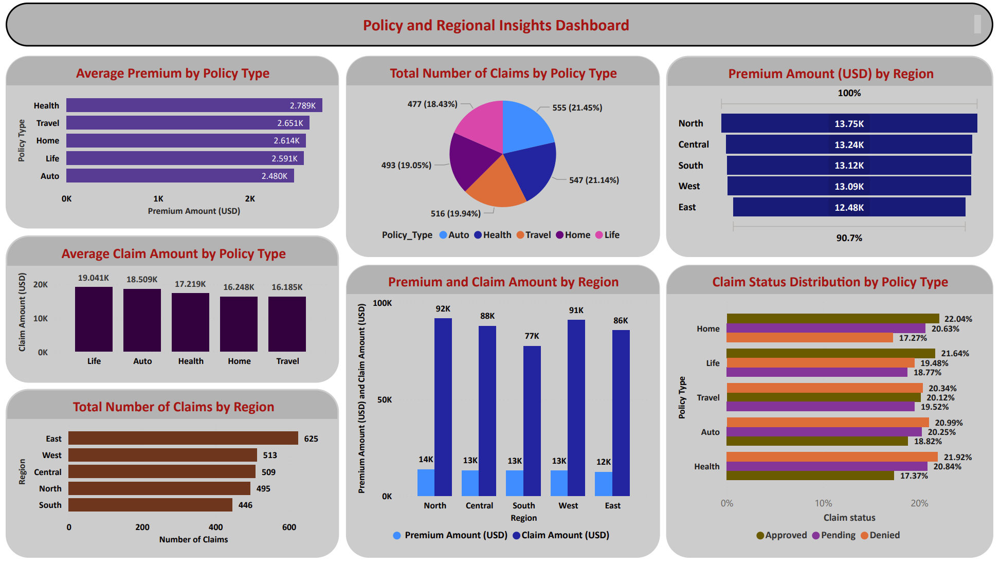
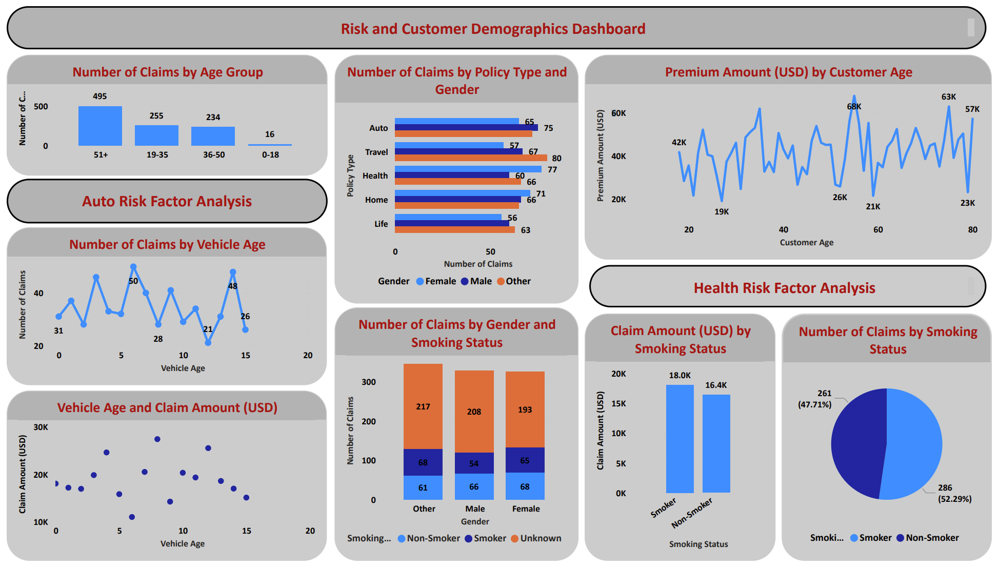

# **Insurance Policy Analytics**

## **Project Summary**  
This project analyzes 1,000 realistic records of insurance policies to identify trends in premiums, claims, risk factors, and regional performance. The goal is to generate actionable insights for optimizing policy pricing, risk assessment, and resource allocation. The analysis leverages Power BI for visualization and Python for data preparation, ensuring a structured and data-driven approach.  

---

## **Data Overview**  

- **Source**: Kaggle: Insurance Dataset.  
- **Key Features**:  
  - **Customer Demographics**: Age, Gender, Region
  - **Policy Details**: Policy Type (Health, Auto, Life, Home, Travel), Premium Amount (USD)
  - **Claims Data**: Claim Amount (USD), Claim Status, Number of Claims
  - **Risk Factors**: Vehicle Age (Auto), Smoking Status (Health/Life), Medical History (Health)  
  

- **Data Preparation**:  
  - Cleaning & Feature Engineering: Missing values (e.g., Vehicle_Age, Smoking_Status) were filled, duplicates removed, and age groups created for demographic analysis.
  - Aggregation: Policy and regional summaries were generated (average premiums, claims, totals), alongside risk-focused datasets (vehicle age for Auto, smoking for Health).
  - Output: Cleaned raw data and aggregated CSVs (policy, region, risk) were exported using Python (Pandas) for Power BI visualization of trends, risks, and profitability.

---

## **Key Insights**  

  - Life,Health and Auto policies have the highest claim rates, indicating higher risk.
  - Vehicle Age < 5 years tend to have lower claim amounts, whereas older vehicles show higher claim frequencies.
  - Smokers file higher health insurance claims, emphasizing a strong correlation with medical expenses  

---

## **Recommendations**  

  - Adjust premium pricing for high-risk segments (e.g., older vehicles, smokers).
  - Implement stricter underwriting for high-risk policies to mitigate losses.
  - Targeted risk mitigation strategies, such as wellness programs for health policyholders. 

---

## **Tools & Technologies**  

- **Python**: Data Cleaning, Preprocessing, Feature Engineering
- **Power BI**: Interactive Dashboards and Data Visualization
- **Pandas & NumPy**: Data Manipulation and Aggregation
- **CSV**: Data Export for Power BI Analysis 

---
  
